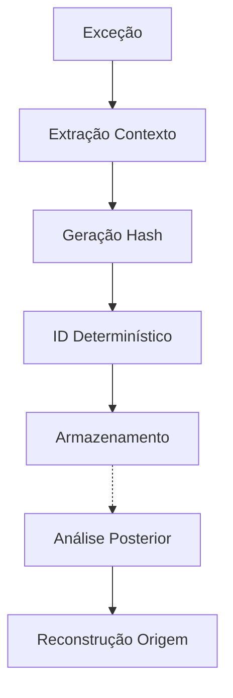
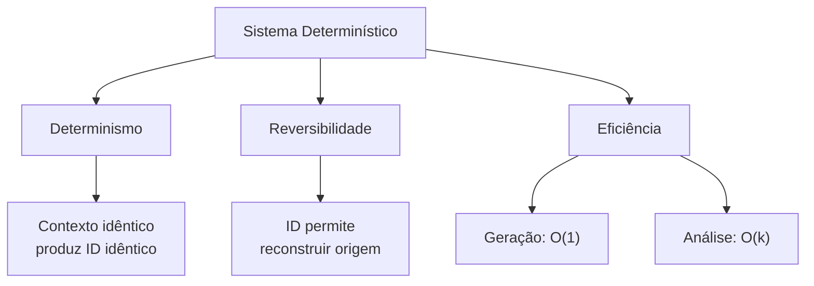
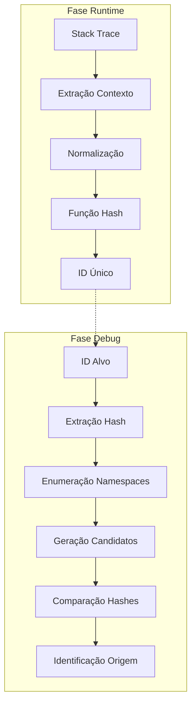
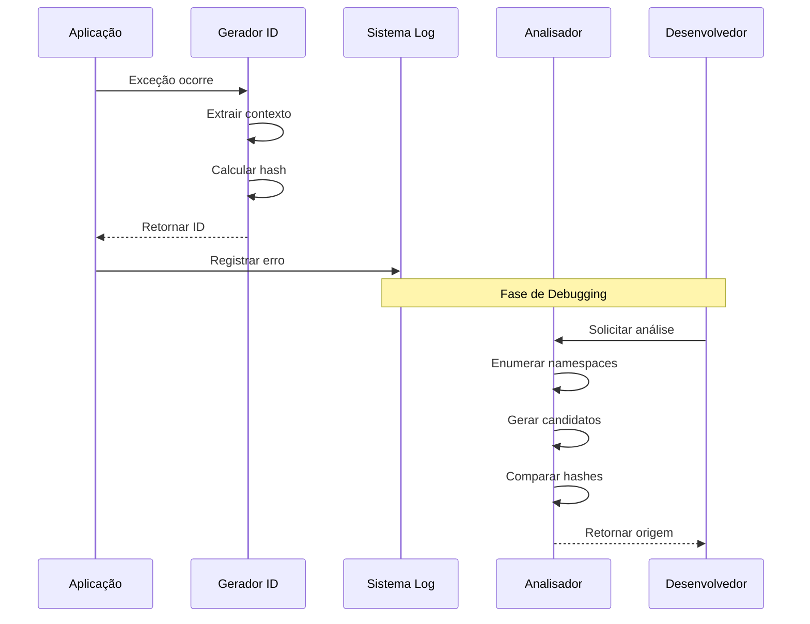
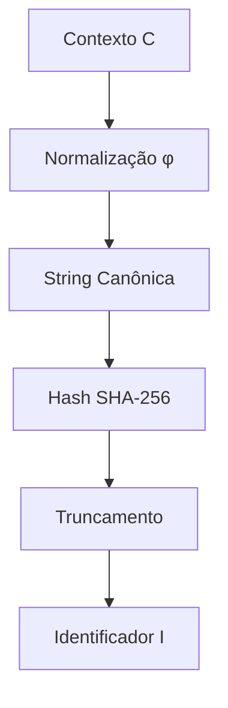
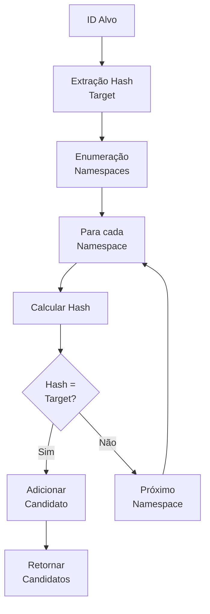
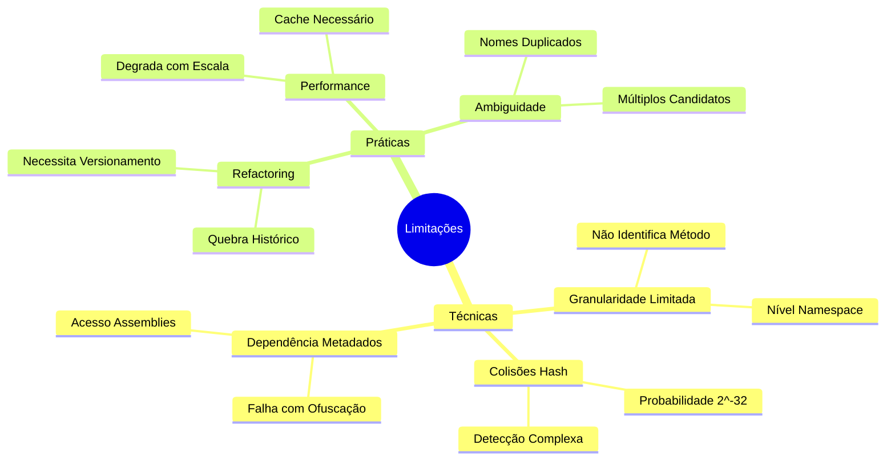
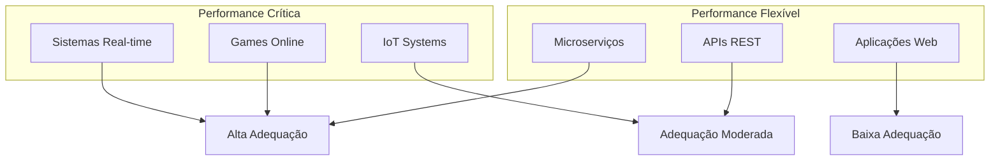
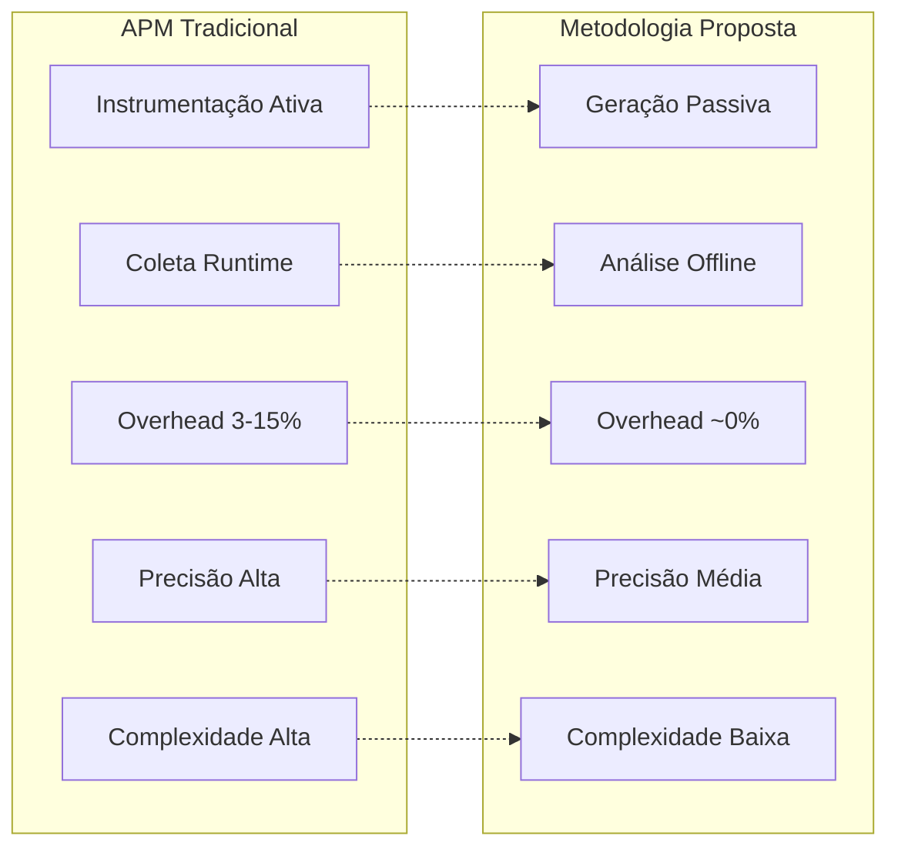
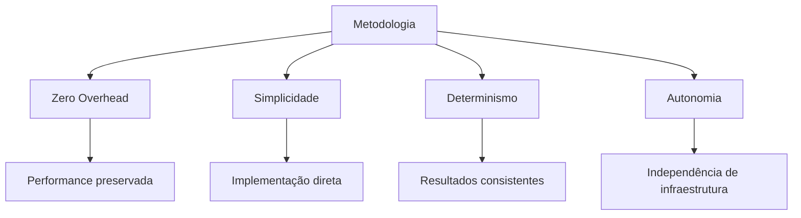

# Engenharia Reversa de Códigos de Erro

### Sistema Determinístico para Rastreamento de Origem

---

## **Resumo**

Este trabalho apresenta uma metodologia para rastreamento de origem de erros através de engenharia reversa de identificadores determinísticos. A abordagem utiliza hashes criptográficos gerados a partir de informações contextuais para criar "impressões digitais" que permitem a reconstrução da origem de exceções. A análise teórica demonstra complexidade computacional O(1) para geração e O(k) para análise reversa.

**Palavras-chave:** engenharia reversa, debugging, hashes criptográficos, rastreamento de erros

---

# **1. Introdução**

<strong>1.1 Problema</strong>

 

**O rastreamento de origem de erros é um desafio fundamental no desenvolvimento de software.** Sistemas tradicionais de monitoramento (APM) requerem instrumentação ativa e geram overhead significativo. Esta metodologia propõe uma alternativa baseada em identificadores determinísticos que permite rastreamento sem impacto na performance.

## **1.2 Solução Proposta**

A solução utiliza hashes criptográficos para codificar informações contextuais em identificadores compactos. Durante uma exceção, gera-se um código baseado no namespace atual. Posteriormente, através de engenharia reversa, reconstrói-se a origem analisando todos os namespaces disponíveis.

### **1.3 Contribuições**

<table>
<tr>
<td width="50%">

**Contribuições Técnicas**

- Algoritmo de geração de identificadores determinísticos
- Método de engenharia reversa para reconstrução de contexto

</td>
<td width="50%">

**Contribuições Analíticas**

- Análise de complexidade computacional e limitações
- Avaliação de casos de uso e cenários de aplicação

</td>
</tr>
</table>

---

# **2. Fundamentação Teórica**

## **2.1 Conceitos Básicos**

| Conceito                         | Definição                                                                                  |
| -------------------------------- | ------------------------------------------------------------------------------------------ |
| **Contexto de Execução**         | Informações disponíveis no momento da exceção (namespace, tipo de erro)                    |
| **Identificador Determinístico** | Hash gerado a partir do contexto que sempre produz o mesmo resultado para o mesmo contexto |
| **Engenharia Reversa**           | Processo de reconstrução do contexto original a partir do identificador                    |

### 2.2 Propriedades do Sistema

| **Determinismo**                                                                            | **Reversibilidade**                                                                           | **Eficiência**                                                                             |
| ------------------------------------------------------------------------------------------- | --------------------------------------------------------------------------------------------- | ------------------------------------------------------------------------------------------ |
| O mesmo contexto sempre gera o mesmo identificador, garantindo consistência entre execuções | Dado um identificador, é possível encontrar o contexto que o gerou através de busca exaustiva | **Geração:** O(1) - operação constante **Análise:** O(k) - linear com namespaces únicos |

---

# **3. Arquitetura do Sistema**

## **3.1 Visão Geral**

> ### **Operação em Duas Fases**
>
> O sistema opera através de duas fases temporalmente separadas, permitindo otimização independente de cada etapa:

1. **Geração (Runtime):** Criação de identificadores durante exceções
2. **Análise (Debug):** Reconstrução da origem através de engenharia reversa

## **3.2 Componentes Funcionais**

<table>
<tr>
<td width="50%">

### **Gerador de Identificadores**

**Responsável pela transformação do contexto de execução em identificador único:**

- Extrai informações do stack trace
- Normaliza dados contextuais
- Aplica função hash criptográfica
- Formata identificador final

</td>
<td width="50%">

### **Analisador Reverso**

**Executa o processo de reconstrução da origem:**

- Enumera todos os namespaces conhecidos
- Gera hashes para cada possibilidade
- Compara com identificador alvo
- Retorna candidatos compatíveis

</td>
</tr>
</table>

### 3.3 Fluxo de Processamento

---

# **4. Modelo Matemático**

### **4.1 Função de Transformação**

A transformação de contexto em identificador segue o modelo:

> ### **Definição Formal:**
>
> | Elemento    | Definição                                                    |
> | ----------- | ------------------------------------------------------------ |
> | **C**       | `(namespace, tipo_erro)` - contexto de execução              |
> | **φ(C)**    | função de normalização que extrai a parte final do namespace |
> | **h(φ(C))** | função hash aplicada ao contexto normalizado                 |
> | **I**       | `"PREFIX-TYPE-" + h(φ(C))` - identificador final             |

### 4.2 Processo de Engenharia Reversa

**Análise de Complexidade:**

| Métrica      | Valor    | Descrição                          |
| ------------ | -------- | ---------------------------------- |
| **Espaço**   | `O(k)`   | k = número de namespaces únicos    |
| **Tempo**    | `O(k)`   | Análise completa                   |
| **Precisão** | Variável | Dependente da unicidade dos hashes |

---

# **5. Análise de Limitações**

### 5.1 Mapa Conceitual de Limitações

## **5.2 Limitações Técnicas**

<strong>Granularidade</strong>

- **Limitação:** Identifica apenas o namespace, não o método específico
- **Impacto:** Múltiplos métodos no mesmo namespace geram códigos idênticos
- **Mitigação:** Uso em conjunto com logs detalhados

<strong>Colisões de Hash</strong>

- **Limitação:** Possibilidade teórica de hashes idênticos para contextos diferentes
- **Probabilidade:** 2^-32 para hash de 32 bits (aproximadamente 1 em 4 bilhões)
- **Detecção:** Identificação através de múltiplos candidatos

<strong>Dependência de Metadados</strong>

- **Limitação:** Requer acesso aos assemblies durante análise
- **Impacto:** Não funciona com código ofuscado ou assemblies inacessíveis
- **Alternativa:** Manutenção manual de mapeamentos

## **5.3 Limitações Práticas**

> **Impacto do Refactoring**
>
> - **Problema:** Mudanças de namespace quebram identificadores históricos
> - **Consequência:** Perda de rastreabilidade para erros antigos
> - **Solução:** Sistema de versionamento de identificadores

> **Degradação de Performance**
>
> - **Cenário:** Sistemas com milhares de namespaces
> - **Impacto:** Análise reversa torna-se lenta
> - **Otimização:** Implementação de cache hierárquico

> **Ambiguidade de Nomes**
>
> - **Situação:** Múltiplos namespaces com mesmo nome final
> - **Exemplo:** `App.Services.User` e `App.Helpers.User` geram "USER-ERR"
> - **Resultado:** Múltiplos candidatos na análise

---

# **6. Casos de Uso e Aplicações**

### 6.1 Matriz de Adequação por Cenário

## **6.2 Cenários Adequados**

### **Debugging em Produção**

- Análise de logs sem instrumentação ativa
- Identificação rápida de origem de erros
- Correlação de problemas em ambientes distribuídos

---

### **Sistemas com Performance Crítica**

- Zero overhead durante execução normal
- Análise offline de problemas
- Preservação de recursos computacionais

---

### **Ambientes Distribuídos**

- Rastreamento sem dependências externas
- Identificadores autodescritivos
- Correlação entre serviços

### 6.3 Cenários Inadequados

**Debugging Detalhado**

- Necessidade de identificar linha específica
- Análise de fluxo de execução complexo
- Debugging interativo em desenvolvimento

---

**Código Altamente Dinâmico**

- Assemblies gerados em runtime
- Namespaces que mudam frequentemente
- Sistemas com estrutura volátil

---

**Sistemas com Muitos Namespaces**

- Performance de análise pode degradar significativamente
- Maior probabilidade de ambiguidade
- Necessidade de recursos computacionais elevados

---

# **7. Avaliação Comparativa**

### 7.1 Comparação com Abordagens Tradicionais

### 7.2 Trade-offs Identificados

| Aspecto            | APM Tradicional     | Metodologia Proposta  |
| ------------------ | ------------------- | --------------------- |
| **Performance**    | Overhead 3-15%      | Overhead ~0%          |
| **Precisão**       | Alta (linha/método) | Média (namespace)     |
| **Complexidade**   | Alta                | Baixa                 |
| **Custo**          | Alto                | Baixo                 |
| **Escalabilidade** | Linear com tráfego  | Linear com namespaces |
| **Dependências**   | Infraestrutura APM  | Nenhuma               |

## **7.3 Recomendações de Uso**

<table>
<tr>
<td width="50%" style="background-color: #e8f5e8;">

### **Utilize esta metodologia quando:**

- Performance é fator crítico
- Simplicidade de implementação é prioridade
- Rastreamento básico de origem é suficiente
- Recursos limitados para ferramentas APM
- Ambientes distribuídos sem infraestrutura centralizada

</td>
<td width="50%" style="background-color: #ffeaea;">

### **Evite esta metodologia quando:**

- Debugging muito detalhado é necessário
- Código muda estrutura de namespaces frequentemente
- Análise de fluxo de execução complexo é requerida
- Sistema possui milhares de namespaces diferentes
- Precisão ao nível de linha é fundamental

</td>
</tr>
</table>

---

# **8. Conclusões**

## **8.1 Síntese da Contribuição**

Esta metodologia representa uma abordagem inovadora para o debugging distribuído, estabelecendo novos paradigmas:

<strong>Paradigma da Separação Temporal</strong>

Separação clara entre codificação (runtime) e decodificação (debug), permitindo otimização independente.

<strong>Paradigma da Informação Mínima</strong>

Máxima informação útil codificada em espaço mínimo, com reconstrução através de conhecimento a priori.

<strong>Paradigma da Autonomia</strong>

Operação independente sem dependências externas durante execução crítica.

### 8.2 Impacto e Aplicabilidade

**A metodologia demonstra particular valor em:**

- **Sistemas com restrições de performance**
- **Ambientes distribuídos** sem infraestrutura centralizada
- **Cenários com recursos computacionais limitados**
- **Aplicações que requerem debugging básico** mas eficiente

### 8.3 Limitações Reconhecidas

**As limitações identificadas definem claramente os domínios de aplicabilidade:**

| Característica                      | Avaliação  |
| ----------------------------------- | ---------- |
| **Debugging no nível de namespace** | Adequada   |
| **Análise detalhada de fluxo**      | Limitada   |
| **Mudanças arquiteturais**          | Sensível   |
| **Estabilidade estrutural**         | Dependente |

### 8.4 Direcionamento Futuro

**O framework estabelecido fornece base sólida para:**

- **Extensões de granularidade**
- **Otimizações de performance**
- **Integração com tecnologias emergentes**
- **Adaptação a novos paradigmas de desenvolvimento**

---

> ### **Conclusão**
>
> A convergência entre simplicidade, eficiência e determinismo posiciona esta metodologia como contribuição relevante para a evolução das práticas de observabilidade em sistemas modernos.

---

**Autor:** Pablo Perozini de Pra

---

_Engenharia Reversa de Códigos de Erro - Sistema Determinístico para Rastreamento de Origem_

